# Kept — the Boomerang design language

> **Status (2026-06-10): approved direction, pre-implementation.** Chosen from a
> three-direction full-rebrand exploration (`brand-board.html`); prototypes live
> at `kept-preview.html` (mobile) and `kept-desktop.html` (desktop) — dev-only
> render harnesses, never shipped. This document is the single source of truth
> for the public-facing iOS + desktop redesign that replaces Wallaby.

**Why it exists.** Wallaby is a faithful study of loggd.life — close enough
(navy canvas, 5-color accent cycle, GitHub-style contribution grids, 5-tab IA,
the orange/green/yellow/red button stack) that shipping it publicly would read
as a clone. Kept keeps Wallaby's *spirit* — history-first glanceability, warm
dashboard energy, semantic clarity, friendly density — and rebuilds every
expression of it from Boomerang's own metaphor.

**The name.** A boomerang is thrown, it returns, and you *keep* it. The brand
verb set: **throw** (capture a task), **return** (snooze/recur — it comes
back), **catch** (complete), **kept** (your history — everything you caught).

---

## 0 · Reference screenshots (shipped UI, captured 2026-07-11)

Real captures of the shipped Kept UI (light mode, seeded dev data) — the
living counterpart to the `kept-preview.html` / `kept-desktop.html` prototypes.

**Mobile (390×844):**

| Today | Tasks | Loops |
|---|---|---|
| 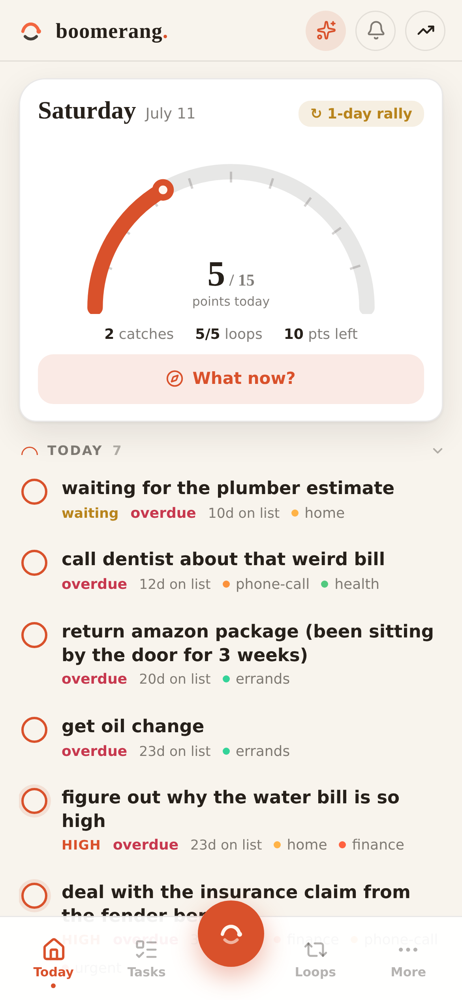 | 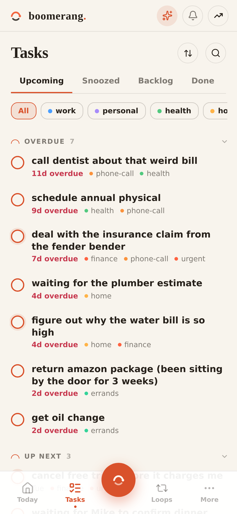 | 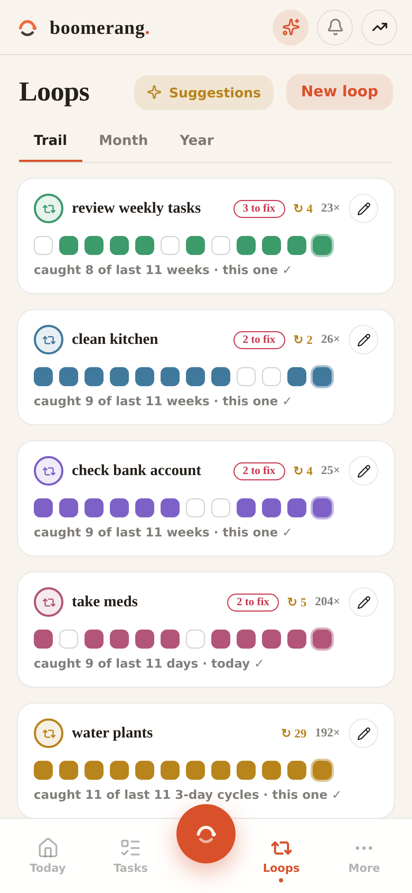 |

| Loop detail | Throw | Task action sheet |
|---|---|---|
| 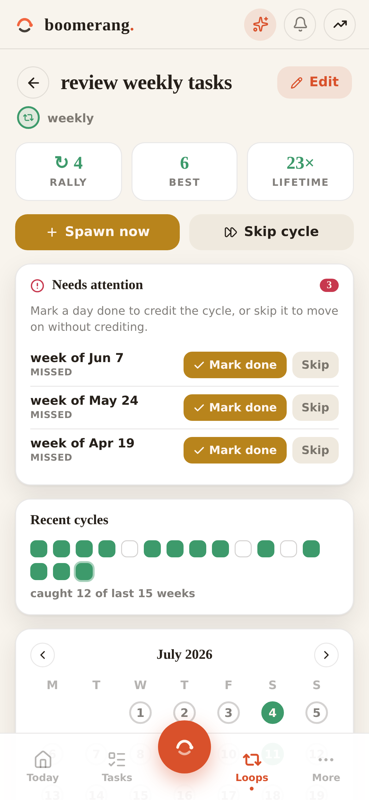 | 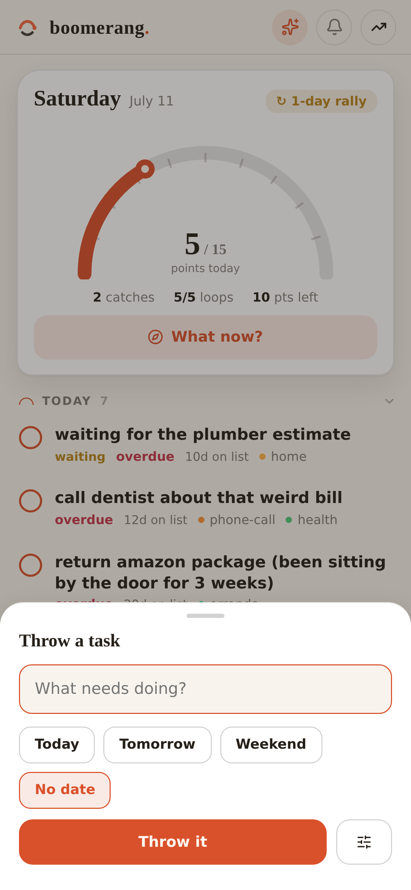 | 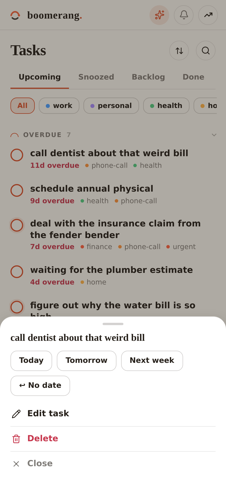 |

| More | What now? | Quick edit |
|---|---|---|
| 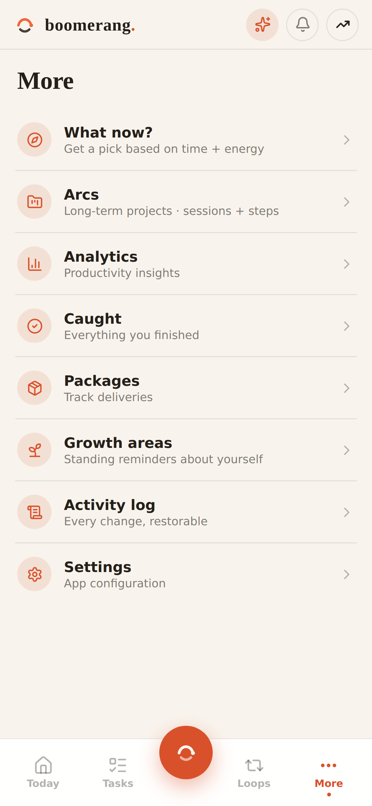 | 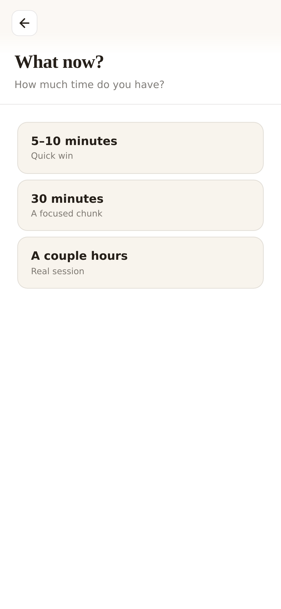 | 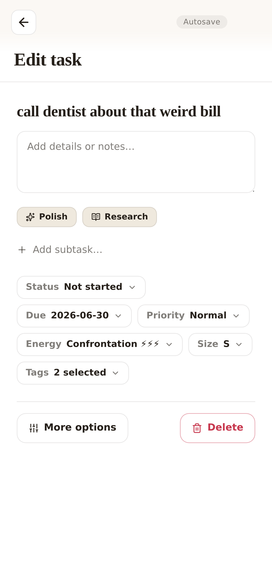 |

**Desktop (1440×900):**

| Today | Tasks (List + rail) |
|---|---|
| 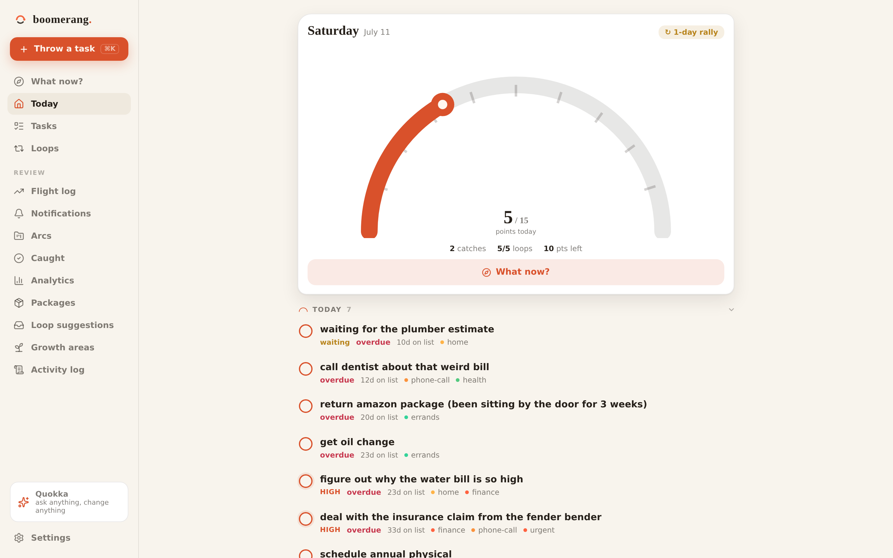 | 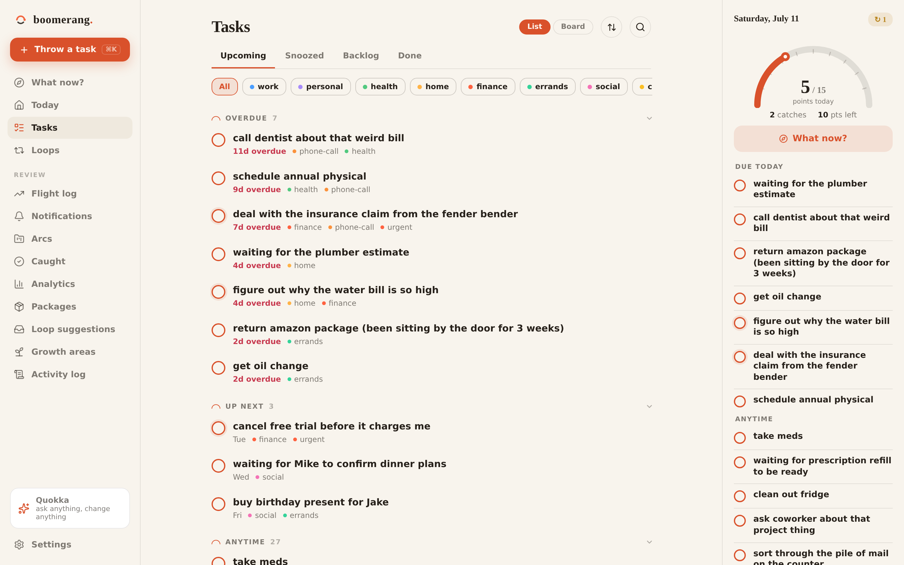 |

| Tasks (Board) | Loops |
|---|---|
| 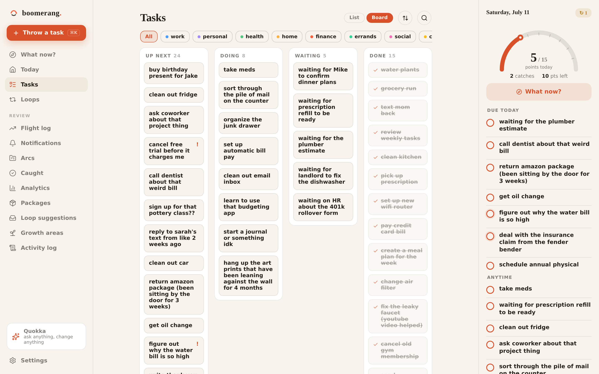 | 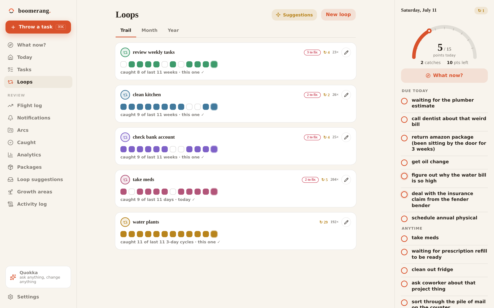 |

| Throw (⌘K) | Quokka |
|---|---|
| 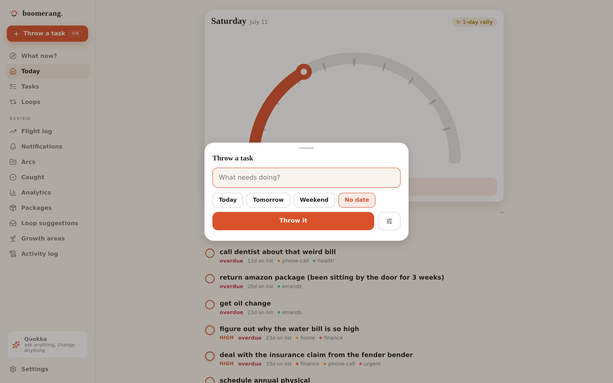 | 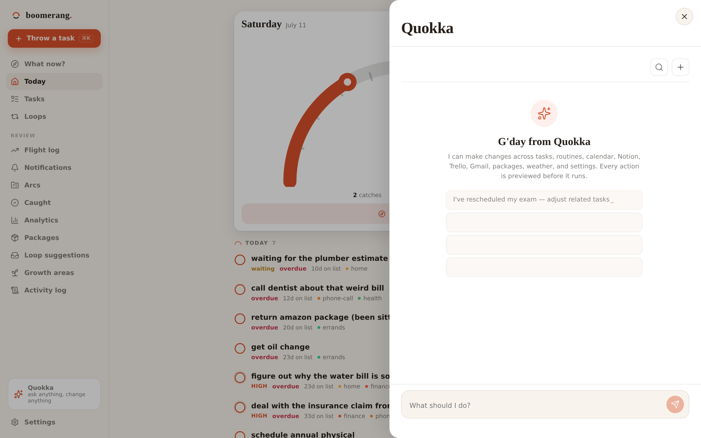 |

---

## 1 · Identity pillars

1. **Arcs, not grids.** loggd is built on squares (heatmap cells, square
   checkboxes, card grids). Kept is built on circles and arcs: round day-dots,
   circular checks, streak *arcs* that physically bridge consecutive days, a
   semicircular day gauge, arc-tick section markers, the arc-into-catch brand
   mark. The arc is the boomerang's flight path; it appears at every scale.
2. **Night-gum + gold, never navy.** The dark canvas is a deep green-ink
   ("Nightgum"), the light canvas a warm green-tinted paper ("Linen"). The one
   hero color is gold-ochre. No popular productivity app — and certainly not
   loggd — lives in this palette.
3. **One hero color.** Gold carries primary actions, completion, progress, and
   focus. Everything else is hairlines, ink, and per-loop "feather" accents
   used *only* for identity (loop rings, tag dots, trail fills) — never for
   chrome. loggd sprays five equal accents across nav, buttons, and FABs; Kept
   doesn't.
4. **Hairline calm, dashboard warmth.** Structure comes from v2's heritage:
   hairline-separated lists, generous whitespace, heavy display titles. Cards
   are reserved for *modules* (the Day Arc, a loop's trail) — never for plain
   list rows. The serif display face keeps it human rather than dashboard-cold.
5. **Motion is flight.** Throw, return, catch — the signature micro-animations
   no other app has (§8).

---

## 2 · Brand assets

**The mark — "arc into catch."** An ochre arc descends into a dot (the
returning boomerang, caught), above an upturned ink curve (the open hand /
catch). At small sizes it reads as a sunrise-smile — keep that; it's the
friendliest accident in the system.

```svg
<svg viewBox="0 0 100 100" fill="none">
  <path d="M 22 52 C 30 18, 70 18, 78 52" stroke="#E3A93C" stroke-width="9" stroke-linecap="round"/>
  <circle cx="78" cy="52" r="7.5" fill="#E3A93C"/>
  <path d="M 30 70 C 42 82, 58 82, 70 70" stroke="#EFF3EC" stroke-width="8" stroke-linecap="round" opacity=".85"/>
</svg>
```
(The catch-curve takes the canvas ink color per palette: `#EFF3EC` on Nightgum,
`#1F2A22` on Linen.)

**Wordmark.** `boomerang.` — lowercase, Fraunces 700, with the period in gold.
The period is the caught dot from the mark; it terminates the name the way the
catch terminates the flight.

**App icon.** The mark centered on a Nightgum→deeper-green vertical gradient
(`#15211B → #0E1511`), rounded-square. Favicon/monochrome contexts: mark only,
single color. Splash: mark + wordmark on flat Nightgum/Linen per system mode.

**Asset checklist for implementation:** `Logo.jsx` replacement (mark, themable
via currentColor/tokens), `favicon.svg`, `icon-180/192/512.png`,
`apple-touch-icon.png`, Pushover application icon, README header.

---

## 3 · Color tokens (`--bm-*`)

> **Palette revision (2026-06-10, "Smoke + Ember"):** the original Nightgum
> green-ink + gold-ochre direction read *earthy* in daily use. The committed
> palette keeps the Kept geometry and one-hero rule but moves to a warm-neutral
> **Smoke** canvas with the brand's original **ember orange** as the hero;
> gold survives as the warm companion accent (rally chips, the ochre feather).

Two first-class palettes; the app **follows the system setting** by default
(manual override stays in Settings). Both ship fully QA'd — neither is "the
alternate."

| Token | Smoke (dark) | Linen (light) | Role |
|---|---|---|---|
| `--bm-bg` | `#16140F` | `#F8F4ED` | canvas (warm neutral, de-greened) |
| `--bm-card` | `#1F1C16` | `#FFFFFF` | module cards |
| `--bm-card-2` | `#29251E` | `#EFE9DE` | elevated / pressed |
| `--bm-hairline` | `rgba(243,238,229,.09)` | `rgba(38,32,26,.10)` | dividers |
| `--bm-hairline-strong` | `rgba(243,238,229,.17)` | `rgba(38,32,26,.20)` | outlines |
| `--bm-text` | `#F3EEE5` | `#26201A` | primary ink |
| `--bm-text-meta` | 56% ink | 58% ink | secondary |
| `--bm-text-faint` | 34% ink | 34% ink | tertiary |
| `--bm-ember` | `#F26640` | `#D9512B` | THE hero (brand orange) |
| `--bm-ember-soft` | ember @ 14% | ember @ 12% | tonal fills |
| `--bm-on-ember` | `#2A1206` | `#FFF6EF` | fg on ember fills |
| `--bm-gold` | `#E8B04B` | `#B8841C` | warm companion: rally chips, ochre feather |
| `--bm-gold-soft` | gold @ 14% | gold @ 13% | rally chip fills |
| `--bm-danger` | `#E0455C` | `#C7384E` | destructive (crimson — never collides with ember) |
| `--bm-trail-empty` | ink @ 10% | ink @ 11% | unfilled day-dots |
| `--bm-scrim` | `rgba(8,6,3,.6)` | `rgba(38,32,26,.35)` | sheet backdrops |
| `--bm-shadow` / `--bm-shadow-pop` | palette-aware | palette-aware | elevation |

**Feathers** — per-loop/per-tag identity colors, warm-earth family. Assigned by
stable full-list index (the Wallaby `routineColors` rule carries over), user-
overridable per loop:

| Feather | Smoke | Linen |
|---|---|---|
| Ochre | `#E8B04B` | `#B8841C` |
| Clay | `#D96C4A` | `#C24E2D` |
| Eucalypt | `#62B98B` | `#3D9A6B` |
| Billabong | `#6FA6C9` | `#41799C` |
| Ironbark | `#9D87D6` | `#7E61C7` |
| Heath | `#C77C9E` | `#B25579` |

Energy types map to feathers (desk→Billabong, people→Ironbark,
errand→Eucalypt, creative→Heath, physical→Clay) — retiring the Tailwind hexes
in `store.ENERGY_TYPES` at implementation time.

**Hard rules.** No raw hex in component CSS/JSX — every color goes through a
`--bm-*` token (the lesson from the Wallaby `--wb-on-action` cleanup is a
day-one rule here). Ember fills always pair with `--bm-on-ember` (dark ink on
ember in Smoke — a deliberately un-loggd move; loggd puts white on
everything). Danger is text/outline-level only; no big red fills.

---

## 4 · Typography & shape

- **Display: Fraunces** (variable; 600–700, optical size on). Screen titles,
  card module titles, hero numerals (Day Arc count, streak numbers), the
  wordmark. The serif warmth is a primary differentiator from every grotesk
  dashboard app.
- **Body: DM Sans** (kept from v2) — rows, buttons, meta, charts.
- Scale: title 26–28 / module title 14.5–15 / row 14.5–15 / meta 12–12.5 /
  micro-label 10.5–11 (700, +0.1em tracking, uppercase).
- **Radii:** 10 (inputs/segments) · 14 (cards) · 22 (sheets) · circles for all
  checks, dots, and the Throw button. **Wing corner** — `22px 14px 14px 14px`
  — is reserved for ONE hero card per screen (Day Arc on Today; the trail card
  on a loop detail). Everything else is symmetric.
- **Hairline lists:** plain rows divided by `--bm-hairline`; cards never wrap
  plain lists. Tags render as **dot + text** (`• finance`), never filled pills.

---

## 5 · Signature data-viz (replaces every contribution grid)

All four live as standalone components (`FlightTrail`, `MonthDots`,
`DensityRibbon`, `DayArc`) shared verbatim between platforms.

1. **Flight Trail** — the default loop history. Rows of 14 round day-dots
   (2 weeks/row, ~10 weeks visible; mini variant = single 14-day row on list
   rows). Filled dots take the loop's feather at intensity-scaled opacity.
   **Consecutive done-days are bridged by a low arc stroke** above the dots —
   streaks are literally drawn as flights. This is the brand visual.
2. **Month Dots** — calendar view: numbered circle cells (outline = empty,
   feather fill = done), weekday-adjacent done-days bridged by the same arcs.
   Month stepper + "N days · %" footer carry over from Wallaby's detail.
3. **Density Ribbon** — the year view: weekly counts as a smooth area curve
   with a feather gradient fade. Replaces the 53-week grid everywhere
   (Flight log year activity, loop year view, analytics 52-week pattern).
4. **Day Arc** — the daily hero: a semicircular gauge sweeping gold from 0 to
   the points goal, hairline ticks at tenths, a gold tip-dot with ink center,
   the count in Fraunces beneath the apex. Sub-line: `N catches · N loops ·
   N pts left`. Tapping/clicking expands the records detail (current
   v2-home-stats behavior folds in here).

Data sources are unchanged: `completed_history`, `/api/analytics/history`,
`computeDailyStats` — Kept is a presentation swap.

---

## 6 · Mobile (iOS) — IA & components

**Bottom nav: 4 tabs + center Throw.** `Today · Loops · [Throw] · Tasks ·
More`. Tabs are ink/meta with gold active state + 4px dot — one accent, no
per-tab colors. **Throw** is a raised 56px gold circle carrying the brand mark:
tap = quick-capture sheet (title + smart date chips), long-press = full add.
Capture is the most important ADHD action; it owns the architectural center.
**Quokka lives in the header** (gold-tinted sparkle button, always one tap from
every screen), not in the nav — its plan-ready badge dots the bell.

- **Today** — header (mark + wordmark · Quokka · bell · avatar) → Day Arc hero
  (wing corner, date + `↻ N-day rally` chip) → **Today** task rows → **Loops**
  rows (feather ring icon · title · cadence/rally meta · mini Flight Trail ·
  feather-ringed catch circle). Stacks fan out exactly as Wallaby Home does.
- **Loops** — Trail/Month/Year via the single segmented style (underline
  indicator, gold); loop cards with full-width viz; detail keeps Wallaby's
  Streak/Best/Total + month calendar structure, restyled (stat row = hairline
  cells, not pill cards).
- **Tasks** — Upcoming/Backlog/Done segments, grouped sections with the
  arc-tick section label, swipe right-to-left = Catch / Delete, row tap = the
  action sheet (grabber, reschedule chips, "Throw it back — returns Mon",
  Edit, Delete).
- **More** — Arcs (projects), Flight log (profile), Analytics, Packages,
  Settings. Same drill-down pattern as Wallaby's More.
- **Editors** — the Wallaby chip editor carries over restyled (chips →
  hairline-outline, expanded pickers use gold-tint selection); "More options"
  full editor likewise. Full-page takeover + back arrow stays.
- **Sheets** — rounded-top 22, grabber, `--bm-scrim` backdrop.

**Checks:** tasks = gold-outline circles (muted hairline when snoozed/low);
loops = feather-outline circles; fills use the ring color with `--bm-on-gold`
ink check (feather fills use dark-ink check `#10241A`). **Snoozed rows** show
the dashed **`↩ returns Sat`** chip — the return is a first-class visual.

---

## 7 · Desktop — the command center

Not scaled-up mobile: a three-zone native-feeling workspace (prototype:
`kept-desktop.html`).

```
┌ sidebar 224 ┬ work surface (flex) ────────────┬ Today rail 308 ┐
│ wordmark    │ Title · view segs · search ⌘/   │ Day Arc card   │
│ [Throw ⌘K]  │ OVERDUE n  ── hairline rows     │ Loops today    │
│ Today       │ TODAY n    (sel row = card-2    │  (ring·title·  │
│ Tasks       │ UP NEXT n   + outline)          │   catch circle)│
│ Loops       │                                 │ rally-at-risk  │
│ Arcs        │                                 │ banner         │
│ ─ REVIEW ─  │                                 │                │
│ Flight log  │                                 │                │
│ Analytics   │                                 │                │
│ Packages    │                                 │                │
│ [Quokka]    │                                 │                │
│ Settings    ┴ kbd hint bar ──────────────────────────────────── │
```

- **Sidebar:** gold **"Throw a task ⌘K"** pill at top (the Throw button's
  desktop form); nav items with count badges; a persistent **Quokka card**
  (last exchange preview) above Settings — desktop Quokka opens as a right
  panel, not a modal.
- **Work surface:** view segments **List / Board / Timeline** — the existing
  Kanban survives as the Board mode (columns restyled: hairline lanes, no
  heavy card chrome); List is default. Selected row gets `card-2` fill +
  hairline outline and drives a right-side **detail panel** (the EditTaskModal
  drawer, restyled) that slides over the Today rail.
- **Today rail:** Day Arc card (wing corner), Loops-today checklist, streak-
  at-risk banner. The rail is the mobile Today screen folded into a column —
  same components, same order, which is what keeps the two platforms feeling
  like one product.
- **Keyboard-first:** persistent hint bar (`⌘K` throw · `J/K` move · `X` catch
  · `S` throw back · `E` edit · `Q` quokka · `?` help). Existing
  `useKeyboardShortcuts` maps over with `⌘K` added.

**Cross-platform coherence rules** (the contract that keeps iOS and desktop
"entirely different but coherent"): identical tokens, identical viz components,
identical row anatomy (check · title · meta/return-chip · feather dots),
identical naming and section labels, identical motion vocabulary. What changes
per platform: navigation chrome (bottom tabs + sheets vs sidebar + panels) and
information density — never the language.

---

## 8 · Motion & haptics

Vocabulary (200–300ms, custom spring `cubic-bezier(.3,1.4,.4,1)`-ish; all
gated on `prefers-reduced-motion`):

- **Catch** — check fills, a 2px gold dot arcs ~24px up-and-back into the
  check (the return), row settles 2px. iOS haptic: `.success` notification.
- **Throw back (snooze)** — row slides right with slight upward arc, fades;
  the `↩ returns` chip stamps in. Haptic: `.light` impact.
- **Throw (capture)** — the Throw button's mark rotates ~12° and springs back;
  the new row drops into the list with a soft arc. Haptic: `.medium` impact.
- **Rally tick** — when a catch extends a streak, the newest trail arc draws
  itself left-to-right (~240ms).
- **Day Arc** — sweeps to its value on screen entry (320ms ease-out), then
  only animates deltas.
- Surface transitions: 180ms fade + 8px slide. Sheets: 240ms spring rise.

---

## 9 · Voice & naming (hybrid)

Plain nouns for navigation — metaphor in verbs and moments. Never make the
user decode jargon to find something; let the personality live where it can't
confuse.

| Concept | UI label | Metaphor usage |
|---|---|---|
| Quick add | **Throw** (button) | "Throw a task" placeholder |
| Complete | check action | Toast: **"Caught it."** / "Nice catch — 3 today." |
| Snooze | Throw it back | Chip: **"↩ returns Tue"** |
| Routine | **Loops** (nav) | "loop closed" in recaps |
| Streak | streak | **"↻ N-day rally"** chip |
| Project | **Arcs** (nav) | "a long arc" in empty states |
| Profile/history | **Flight log** | year activity = "your flights" |

("Loops" and "Arcs" are the two metaphor nouns promoted to navigation — both
self-explanatory enough to pass the no-decoding rule; "Habits" and "Projects"
remain as subtitle glosses during transition, e.g. "Arcs · long-term
projects".)

---

## 10 · Accessibility

- Contrast floors: body ink ≥ 7:1 on canvas, meta ≥ 4.5:1, gold-on-canvas ≥
  3:1 for large/bold UI text only — gold never carries small body text;
  `--bm-on-gold` pairs are ≥ 7:1 in both palettes.
- Color is never the only signal: trail dots pair filled/empty shapes, streak
  arcs duplicate the rally number, feather identity pairs with the loop's
  icon, done-states strike through.
- Touch targets ≥ 44pt; the Throw button 56pt. Dynamic-type-friendly: rows
  wrap, viz components scale off a single `--bm-cell` custom prop (Wallaby
  heatmap pattern).
- Full reduced-motion variants (state changes swap instantly, no arcs drawn).

---

## 11 · Why this is legally & ethically distinct from loggd

| Axis | loggd / Wallaby | Kept |
|---|---|---|
| Canvas | deep navy | green-ink Nightgum / Linen paper |
| Accent model | 5 equal accents on chrome | one gold hero; feathers for identity only |
| History viz | GitHub contribution grid | Flight Trail dots + streak arcs / Density Ribbon |
| Geometry | squares, square cells, pills | circles, arcs, hairlines, dot-tags |
| Buttons | orange/green/yellow/red stack | gold fill · gold tonal · ghost · danger text |
| Fill foregrounds | white on everything | dark ink on gold |
| Nav | 5 flat color-coded tabs | 4 tabs + center Throw; sidebar command center on desktop |
| Type | grotesk throughout | Fraunces serif display + DM Sans |
| Identity moves | — | wing corner, arc-tick labels, `↩ returns` chip, throw/catch motion, `boomerang.` wordmark |

The retained *ideas* — glanceable per-habit history, a daily dashboard, a
range-segmented detail view — are unprotectable genre conventions shared by
every habit tracker; every *expression* of them above is original.

---

## 12 · Migration plan (Wallaby → Kept) — the rebuild IS the cleanup

Same reversible playbook that built Wallaby (parallel theme family, surface by
surface), but every phase retires technical debt. Kept must not become a THIRD
design language stacked on Wallaby + dormant Terminal — the end state is **one**
language and a structurally cleaner codebase.

- **K0 — Demolition (before any Kept code).** Execute the documented Terminal
  "didn't stick" teardown: `rm -rf src/v2/terminal/`, delete `useTerminalMode`,
  strip `terminalTitle`/`terminalCommand` props from every ModalShell/
  EmptyState/ConfirmDialog call site, drop both `check:terminal-*` CI scripts,
  keep only the `terminal-*` → theme migration shim in `loadSettings()`.
  Flatten `src/v2/` → `src/` (done — `v2` was
  meaningless once v1 was gone). Purge stale settings keys
  (`v1_disabled`, legacy `show_week_strip`) and consolidate the theme
  pre-paint/mount/picker maps into one shared module. Net: the bundle drops to
  exactly two languages (Standard + Wallaby) before Kept adds its own.
- **K1 — Brand + tokens.** New mark/wordmark/icons; `src/kept/palette.css`
  (`--bm-*`, `kept-dark`/`kept-light` + system-follow); Fraunces in
  `index.html`. **Cleanup baked in:** energy-type colors move into the token
  layer (feather mapping) with ONE source of truth — retiring the four
  duplicate energy color/icon definitions (`store.ENERGY_TYPES`, TaskCard,
  HomeView/HabitsView, WallabyEditTask).
- **K2 — Viz components.** `FlightTrail`, `MonthDots`, `DensityRibbon`,
  `DayArc` — built once, consumed identically by mobile and desktop. **Cleanup
  baked in:** one canonical date module (merging the two `localYMD`s +
  `parseLocalDate` into a single `src/dates.js` with the date-only-string
  contract documented), since every viz component depends on it.
- **K3 — Mobile shell.** KeptNav (4+Throw), header, Today, quick-capture
  sheet. **Cleanup baked in:** the AppV2 god-file split — KeptShell owns
  navigation/surface state, each surface container owns its own handlers and
  modal state; AppV2 shrinks to data-wiring + the shared-hook layer instead of
  ~40 useStates and every handler in one 1,600-line file.
- **K4 — Mobile surfaces.** Loops/detail, Tasks + action sheet, More, Arcs,
  Flight log; editors. **Rule: no reskin-by-override.** Kept surfaces are
  built Kept-first against `--bm-*` tokens; there will be NO
  `[data-theme^="kept"]` override stylesheets layered on shared components
  (the Wallaby `forms/settings/analytics/modals.css` override pattern — with
  its `!important`s and import-order traps — dies with Wallaby).
- **K5 — Desktop command center.** Sidebar, work surface (List default,
  Kanban as Board mode), Today rail, detail panel, ⌘K throw. SettingsModal
  gets split into per-tab panel files as it's restyled (the other god file).
- **K6 — Cutover + Wallaby teardown.** Default new installs to system-follow
  Kept; Wallaby demoted for one release, then `src/wallaby/` + every
  `[data-theme^="wallaby"]` override file is deleted (same teardown discipline
  as Terminal in K0). End state: ONE design language (Kept), Standard kept
  only as a minimal fallback or removed too — decided at cutover.
- **Throughout:** unit tests land with the pieces that keep regressing —
  the date module (K2) and scoring get real test coverage as they're touched,
  not after.

Each phase is an independently mergeable PR with screenshot verification in
both palettes (the Local-Verification-Harness runbook applies unchanged).

## 13 · Feedback backlog (2026-06-11 prod tire-kicking round)

Captured from live use; these are the next design lifts, in priority order.

### 13a · Cadence-aware loop trails (replace the dot grids on Loops cards)
The full FlightTrail dot grid (6×13 dots + streak arcs) eats a card's worth
of space and reads as noise for anything that isn't a multi-step daily loop —
a weekly loop shows ~95% empty dots and the arcs almost never connect.
Direction: **the visualization unit should be the loop's own cadence cycle,
not the calendar day.**
- Daily loops → keep a trail but compact: a single 14–21 day row (the `mini`
  FlightTrail), not a grid.
- Weekly/monthly/quarterly/annual + custom-interval loops → a row of the
  last 8–12 **cycle chips**: each chip = one cadence window, filled (caught),
  hollow (missed), half (skipped via skip-cycle). Plus a "next due" caption.
- Habit-mode (target frequency) → progress ring or `n/target` bar for the
  current window, with cycle chips for past windows.
- The Single/Month/Year range tabs stay for the drill-down detail; the card
  face gets the compact cadence-fit visual only.

### 13b · Kept-native editors (kill the reskinned v2 forms)
The Edit-loop / Edit-task full-page forms are the v2 modals with Kept paint —
dense ALL-CAPS field stacks that read foreign next to the Kept surfaces.
Direction: **progressive disclosure, Kept type-scale.**
- Top: name field as a large Fraunces headline input.
- The 2–3 high-frequency decisions as chip rows (cadence, day, time) —
  tap-to-pick, not select boxes.
- Everything else (anchors, auto-roll, end date, follow-up chains, stack
  members, nag policy) behind hairline disclosure rows that expand in place.
- Same skeleton for task editor: title, when (date/snooze), energy chips;
  notes/checklist/links/integrations under disclosures.
- Per K4 rule: built Kept-first against `--bm-*` tokens, no override CSS.

### 13c · Achievements expansion (future feature; user: "be really creative")
10/12 earned already — the wall needs depth and wit. Candidate directions
(ADHD-honest, anti-perfectionist; metaphor-aligned with the brand):
- **Recovery class** (the signature set): *Phoenix* — start a new rally after
  losing a 14+ day one; *It Comes Back* — complete a task 30+ days old;
  *Clean Sweep* — clear every overdue task in a day; *Back From Orbit* —
  return after 7+ days away and catch 3 the same day.
- **Honesty class:** *Strategic Retreat* — set-aside 5 tasks (knowing your
  limits is a skill); *Editor* — delete 10 tasks you were never going to do;
  *Reframed* — use the reframe flow 5 times.
- **Time-of-day / pattern class:** *Dawn Patrol* — 3 catches before 8am;
  *Night Shift* — clear a loop after 10pm; *Weekend Warrior* — 10-catch
  weekend; *Speedrun* — 5 catches within an hour of waking (first catch).
- **Energy class:** *Dragon Slayer* — catch a ⚡⚡⚡ confrontation task;
  *Balanced Diet* — catch every energy type in one week; *Heavy Lifting* —
  3 L/XL tasks in a day.
- **Loop class:** *Perfect Week* — every due loop caught for 7 days;
  *Stack Champion* — 10 stack clear-bonuses; *Long Haul* — keep a
  quarterly+ loop alive for a year.
- **Meta class:** *Quokka Whisperer* — 25 applied Quokka plans; *Archivist* —
  10 knowledge entries; *Weatherproof* — catch an outdoor task on a
  best-day recommendation.
- Mechanics notes: tiered (bronze/silver/gold) where counts scale; hidden
  achievements that reveal on earn (the fun ones); all derived values must
  follow the Derived-Stat Durability Rules (persist earn-time provenance,
  never recompute from deletable rows — see CLAUDE.md).

## 14 · Quokka surface redesign (Q-plan, 2026-06-12 prod report)

User report: chat "(a) struggles to keep messages in order, (b) has some
pretty massive overscroll issues, (c) feels like we bolted v2 into Kept
again." All three confirmed with exact causes:

**(a) Ordering — the event handler updates by POSITION, not identity.**
Every streaming event in `useAdviser` does
`setMessages(prev => [...prev.slice(0, -1), {...pending}])` — "replace
whatever happens to be last." Race a user send, a reconnect replay, or a
queued message against in-flight events and the wrong message gets
clobbered. Compounding: the SSE resubscribe path replays the session's
whole event buffer with NO consumed-index filter (only the poll path
tracks `startFrom`), and `ensurePlaceholder` adopts "the last assistant
message if not committed" — replayed content merges into the wrong bubble
or duplicates.

**(b) Overscroll — two nested scrollers fighting.** In Kept, `.v2-modal`
IS the full-page scroller (modals.css), and `.v2-adviser-messages` is a
second scroller capped at `max-height: 60dvh` inside it. iOS scroll
chaining + the fixed back-button strip = clipped content, the message
pane drifting under the pinned controls, sideways shift. Chat needs ONE
scroller in a fixed viewport column; today it's a scrollable document
containing a scrollable box.

**(c) Bolted-in — literally.** ModalShell + `v2-adviser-*` styles +
`wb-icon-btn` toolbar buttons, full-page-ified by override CSS designed
for forms, not chat.

**(d) Reopen lands at the TOP of the last chat** (prod report: "uber
annoying — I have to either back out or scroll to the bottom"). The
auto-scroll effect only fired on message changes and only scrolled the
INNER pane — on open, messages hydrate async and the outer page scroller
stayed at the top. Hotfixed 2026-06-12 (scroll both scrollers on open +
after hydration settle); Q2's single-scroller layout removes the dual-
scroller problem entirely and adds stick-to-bottom with a "↓ latest" pill.

### The plan — three phases, independently shippable

**Q1 — Chat engine correctness (no visual change).**
- Every message gets a stable `id`; stream events update BY ID
  (`prev.map(m => m.id === pendingId ? next : m)`), never by position.
- One consumed-event cursor per session, honored by BOTH the SSE replay
  and the poll path — replays skip `idx < cursor`, killing duplicates.
- One placeholder per runner-start, keyed to the turn; the
  "adopt last uncommitted assistant" heuristic dies.
- Harness-verifiable with scripted SSE fixtures (send-during-stream,
  reconnect mid-turn, queued sends).

**Q2 — QuokkaSurface, Kept-native (replaces AdviserModal's shell).**
- NOT a ModalShell modal: `position: fixed; inset: 0` three-row column —
  slim header (back · chat title · history · new), the message pane as
  THE one scroller (`overscroll-behavior: contain`, auto-stick-to-bottom
  with a "↓ latest" pill when scrolled up), composer pinned to the bottom
  with safe-area padding and the frosted chrome (nav-bar treatment).
- Kept voice: USER messages as ember-tinted right-aligned bubbles; QUOKKA
  replies as plain document text on the canvas (no bubble — the calm
  voice); tool activity as gold sparkle chips with live status
  ("✦ search_tasks ✓"); the STAGED PLAN as a hairline card with the
  ember "Apply N changes" pill — the review moment is the hero of the
  surface, per the atomic-execute model.
- Desktop: same component centered in a 720px column over the work
  surface; ⌘K continues to open Throw, the sidebar Quokka row opens this.

**Q3 — Polish.** Kept-styled suggestion chips, history as a slide-over
panel, expiry banner as a quiet hairline note, the `wb-icon-btn` usages
replaced (when QuickEditTask is rebuilt bm-first, wb-compat.css dies).

### Tracked alongside (user-deferred): KB create-but-error
Quokka creates knowledge entries successfully but REPORTS an error —
likely the MCP create succeeds and the response parsing throws after the
side effect, so the tool result reads as failure. Diagnose in
`createKnowledgeItem` response handling when the user circles back.
